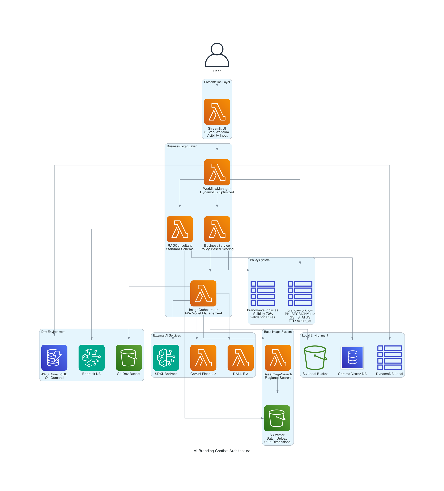

# 설계 문서

## 개요

AI 브랜딩 챗봇을 macOS + Docker 환경에서 처음부터 새로 구현한다. 5단계 워크플로(정보입력 → 분석 → 상호명 → 이미지 → 보고서)로 단순화하고, 3개 AI 모델(DALL-E/SDXL/Gemini)로 간판/인테리어 이미지를 생성한다. 환경별(local/dev) 저장소를 분리하여 개발과 운영을 구분한다.

## 아키텍처 (AWS 베스트 프랙티스 적용)

### 시스템 아키텍처 다이어그램

```
┌─────────────────────────────────────────────────────────────────┐
│                    AI 브랜딩 챗봇 시스템 아키텍처                      │
│                     (AWS 베스트 프랙티스 적용)                       │
└─────────────────────────────────────────────────────────────────┘

┌─────────────────┐
│  Streamlit UI   │ ← 6단계 워크플로, 가시성 요소 입력
│  (프레젠테이션)    │
└─────────┬───────┘
          │
          ▼
┌─────────────────────────────────────────────────────────────────┐
│                     비즈니스 로직 레이어                           │
├─────────────────┬─────────────────┬─────────────────┬───────────┤
│ WorkflowManager │  BusinessService │ ImageOrchestrator│RAGConsultant│
│ (DynamoDB 최적화)│  (정책 기반)     │     (A2A)       │(표준 스키마)│
└─────────┬───────┴─────────┬───────┴─────────┬───────┴─────┬─────┘
          │                 │                 │             │
          ▼                 ▼                 ▼             ▼
┌─────────────────┐ ┌─────────────────┐ ┌─────────────────┐ ┌─────────────────┐
│brandy-workflow  │ │brandy-eval-     │ │  외부 AI 서비스  │ │ Base Image      │
│ (AWS 최적화)    │ │policies         │ │ ┌─────────────┐ │ │ 시스템          │
│                 │ │ (검증 규칙)     │ │ │ DALL-E 3    │ │ │ ┌─────────────┐ │
│PK: SESSION#uuid │ │                 │ │ │ SDXL        │ │ │ │S3 Vector    │ │
│SK: METADATA     │ │policy_id        │ │ │ Gemini 2.5  │ │ │ │배치 업로드  │ │
│GSI1PK: STATUS   │ │validation_rules │ │ └─────────────┘ │ │ │1536 차원    │ │
│expire_at (TTL)  │ │created_by       │ └─────────────────┘ │ └─────────────┘ │
└─────────────────┘ └─────────────────┘                   └─────────────────┘
          │                                                         │
          ▼                                                         ▼
┌─────────────────────────────────────────────────────────────────┐
│                        데이터 레이어                              │
├─────────────────────────────┬───────────────────────────────────┤
│        Local 환경           │           Dev 환경                │
├─────────────────────────────┼───────────────────────────────────┤
│ ┌─────────────────────────┐ │ ┌─────────────────────────────────┐ │
│ │ DynamoDB Local (Docker) │ │ │ AWS DynamoDB (온디맨드)          │ │
│ │ S3 Local Bucket         │ │ │ S3 Dev Bucket                   │ │
│ │ Chroma Vector DB        │ │ │ Bedrock Knowledge Base          │ │
│ └─────────────────────────┘ │ └─────────────────────────────────┘ │
└─────────────────────────────┴───────────────────────────────────┘
```

### AWS 최적화 적용사항

#### 1. DynamoDB 최적화
- **파티션 키 설계**: `PK: SESSION#uuid` 형태로 핫 파티션 방지
- **GSI 활용**: `GSI1PK: STATUS#active`로 활성 세션 효율적 조회
- **TTL 자동 정리**: `expire_at` 필드로 세션 자동 삭제
- **온디맨드 모드**: 예측 불가능한 워크로드에 최적화

#### 2. S3 Vector 최적화
- **배치 업로드**: 최대 500개 벡터를 배치로 처리
- **벡터 차원**: 1536 차원 (OpenAI 임베딩 호환)
- **메타데이터 표준화**: 일관된 키 구조 사용

#### 3. RAG 시스템 표준화
- **공통 메타데이터**: query, timestamp, source, embedding_model, confidence_threshold, request_id
- **오류 처리**: confidence_threshold 기반 품질 관리
- **폴백 전략**: 다단계 폴백 메커니즘

#### 4. 성능 최적화
- **Lambda**: 프로비저닝된 동시성으로 콜드 스타트 최소화
- **메모리 할당**: 비용 vs 성능 균형 최적화
- **API 호출**: 배치 처리로 호출 횟수 최소화

### 데이터 플로우 (AWS 최적화)

1. **사용자 입력** → WorkflowManager (DynamoDB 최적화된 상태 저장)
2. **다차원 분석** → BusinessService (정책 기반 스코어링 + 검증 규칙)
3. **이미지 생성** → ImageOrchestrator (A2A + Base Image 참조)
4. **RAG 검증** → RAGConsultant (표준 스키마 + 오류 처리)
5. **최종 보고서** → S3 Vector (배치 업로드 + 메타데이터 태깅)

### 성능 목표 (시연 SLA)

- 상호명 3개 생성: ≤ 10초
- 간판/인테리어 각 3안 생성: ≤ 30초  
- 전체 워크플로: ≤ 5분
- 텍스트 응답: ≤ 5초
- 진행 상황 표시 + ETA 제공

### 레이어 구조

1. **프레젠테이션 레이어**: Streamlit 5단계 워크플로 UI (진행 상황 + ETA 표시)
2. **비즈니스 로직 레이어**: 워크플로 관리자 + 이미지 생성 오케스트레이터 + PDF 생성기
3. **데이터 레이어**: 환경별 저장소 (Local: DynamoDB Local + 로컬 S3, Dev: AWS DynamoDB + AWS S3)
4. **벡터 레이어**: 환경별 벡터 스토어 (Local: Chroma, Dev: Bedrock KB)
5. **외부 서비스**: 3개 이미지 AI (DALL-E 3, SDXL, Gemini Flash 2.5)

## 컴포넌트 및 인터페이스

### 1. 웹 인터페이스 (Streamlit)

**파일**: `app.py`

**책임**:
- 6단계 워크플로 UI 제공
- 단계별 진행 상태 표시
- 사용자 입력 수집 및 결과 표시
- RAG 상담 채팅 인터페이스
- **애플리케이션 시작 시 데이터 초기화**: DynamoDB 연결 및 JSON 데이터 마이그레이션

**주요 메서드**:
```python
def main():
    """메인 애플리케이션 진입점 및 데이터 초기화"""
    
def initialize_app_data():
    """앱 시작 시 DynamoDB 데이터 초기화 (regions.json, business_types.json)"""
    
def step1_collect_info():
    """1단계: 정보 입력
    - 업종/지역/평수 입력 (DynamoDB에서 로드된 데이터 사용)
    - 사진 업로드 선택 옵션
    - 진행 상황 표시
    """
    
def step2_show_analysis():
    """2단계: 분석 요약
    - 간단한 점수/레이더 차트 표시
    - 분석 결과 요약
    """
    
def step3_select_business_name():
    """3단계: 상호명 제안
    - 3개 추천 (설명 + 점수 포함)
    - 재추천 기능 (최대 3회, 중복 회피)
    - 선택 또는 재추천 버튼
    """
    
def step4_generate_images():
    """4단계: 이미지 생성
    - 간판 3안 (DALL-E/SDXL/Gemini)
    - 인테리어 3안 (DALL-E/SDXL/Gemini)
    - 카드 형태 표시 + 간단 설명
    - 색상 팔레트 + 예산 표시
    - 폴백 이미지 처리
    """
    
def step5_generate_report():
    """5단계: 보고서 생성
    - PDF 보고서 생성 (모든 선택사항 포함)
    - 다운로드 버튼 제공
    - 벡터화 (Chroma/Bedrock KB)
    """
```

### 2. 워크플로 관리자 (DynamoDB 기반)

**파일**: `core/workflow_manager.py`

**책임**:
- DynamoDB 기반 6단계 워크플로 상태 관리
- 단계별 진행 상태 추적 및 정책 버전 기록
- 단계 간 데이터 전달 및 TTL 관리
- **애플리케이션 시작 시 초기 데이터 로드**: DataInitializer를 통한 JSON 데이터 DynamoDB 마이그레이션

**DynamoDB 테이블**: `brandy-workflow` (AWS 베스트 프랙티스 적용)
```json
{
  "PK": "SESSION#uuid",
  "SK": "METADATA",
  "session_id": "uuid",
  "current_step": 1,
  "steps": {
    "1": {"status": "completed", "payload": {...}, "policy_ref": "scoring-v1.0"},
    "2": {"status": "in_progress", "payload": {...}}
  },
  "GSI1PK": "STATUS#active",
  "GSI1SK": "2024-01-01T00:00:00Z",
  "version": "1.0",
  "expire_at": 1234567890
}
```

**DynamoDB 설계 최적화**:
- **파티션 키**: `SESSION#uuid` 형태로 핫 파티션 방지
- **GSI**: 활성 세션 조회용 글로벌 보조 인덱스
- **TTL**: `expire_at` 필드로 자동 세션 정리
- **온디맨드 모드**: 예측 불가능한 워크로드에 최적화

**주요 메서드**:
```python
class WorkflowManager:
    def __init__(self, storage: BaseStorage, environment: str):
        """워크플로 관리자 초기화 및 데이터 초기화"""
        
    def initialize_system_data(self) -> bool:
        """시스템 시작 시 초기 데이터 로드 (regions.json, business_types.json)"""
        
    def start_workflow(self, session_id: str) -> dict:
        """워크플로 시작 (DynamoDB 세션 생성)"""
        
    def complete_step(self, session_id: str, step: int, data: dict, policy_ref: str) -> dict:
        """단계 완료 처리 (payload + policy_ref 저장)"""
        
    def get_current_step(self, session_id: str) -> int:
        """현재 단계 조회 (DynamoDB에서 로드)"""
        
    def can_proceed_to_step(self, session_id: str, step: int) -> bool:
        """다음 단계 진행 가능 여부"""
        
    def get_regions_from_db(self) -> dict:
        """DynamoDB에서 지역 데이터 조회 (기존 JSON 파일 대체)"""
        
    def get_business_types_from_db(self) -> dict:
        """DynamoDB에서 업종 데이터 조회 (기존 JSON 파일 대체)"""
```

### 3. 핵심 서비스

**파일**: `core/business_service.py`

**책임**:
- 다차원 분석 로직
- 상호명 생성 로직
- 간판/인테리어 디자인 생성 로직
- 최종 보고서 생성

**주요 메서드**:
```python
class BusinessService:
    def analyze_business_simple(self, business_info: dict) -> dict:
        """간단한 분석 및 점수 계산
        
        단순화된 스코어링:
        - 발음 용이성: 음절수, 모음/자음 비율
        - 검색 용이성: 키워드 매칭, 중복도
        - 지역 적합성: 지역 특성 반영
        
        반환: {"scores": {...}, "radar_chart_data": {...}, "summary": "..."}
        """
        
    def generate_business_names(self, business_info: dict, exclude_names: List[str] = []) -> List[dict]:
        """상호명 3개 생성 (중복 회피)
        
        반환: [{"name": "상호명", "description": "설명", "scores": {"발음": 85, "검색": 90}}]
        """
        
    def generate_sign_images(self, business_name: str, business_info: dict) -> List[dict]:
        """간판 이미지 3안 생성 (DALL-E/SDXL/Gemini)"""
        
    def generate_interior_images(self, business_name: str, business_info: dict, sign_style: str) -> List[dict]:
        """인테리어 이미지 3안 생성 (선택 간판과 조화)"""
        
    def generate_pdf_report(self, session_data: dict) -> str:
        """PDF 보고서 생성
        
        포함 항목:
        - 최종 상호명
        - 간판 3안 (선택 표시)
        - 인테리어 3안
        - 색상 팔레트
        - 예산 범위
        - 분석 요약
        """
```

### 6. Base Image 검색 시스템

**파일**: `core/base_image_search.py`, `core/image_indexer.py`

**책임**:
- 지역별 base image S3 디렉토리 관리
- 키워드 기반 이미지 검색 및 메타데이터 매칭
- 간단 모드(JSON 인덱스) / 고급 모드(벡터 임베딩) 지원

**주요 메서드**:
```python
class BaseImageSearch:
    def __init__(self, environment: str):
        """Base Image 검색 시스템 초기화"""
        
    def search_base_images(self, region: str, kind: str, keywords: List[str], k: int = 3) -> List[BaseImage]:
        """지역별 base image 검색
        
        Args:
            region: 지역명 (부평, 논현 등)
            kind: 이미지 종류 (signs, interiors)
            keywords: 검색 키워드 리스트
            k: 반환할 이미지 개수
            
        Returns:
            BaseImage 객체 리스트 (메타데이터 포함)
        """
        
    def get_fallback_images(self, kind: str, k: int = 3) -> List[BaseImage]:
        """공통 폴더에서 폴백 이미지 조회"""
        
    def index_images(self, bucket_name: str) -> bool:
        """S3 버킷의 이미지들을 인덱싱"""

class ImageIndexer:
    def create_simple_index(self, bucket_name: str) -> dict:
        """JSON 기반 간단 인덱스 생성"""
        
    def create_vector_index(self, bucket_name: str) -> bool:
        """벡터 임베딩 기반 고급 인덱스 생성"""
```

**S3 디렉토리 구조 및 인덱스 관리**:
```
branding-base-images-{env}/
├── 부평/
│   ├── signs/
│   │   ├── image1.jpg
│   │   ├── image1.jpg.meta.json
│   │   └── ...
│   └── interiors/
│       ├── interior1.jpg
│       ├── interior1.jpg.meta.json
│       └── ...
├── 논현/
│   ├── signs/
│   └── interiors/
├── 공통/
│   ├── signs/
│   └── interiors/
├── index.json          # 간단 모드 인덱스
├── index_version.txt   # 인덱스 버전 관리
└── .index_metadata/    # 인덱스 생성/갱신 메타데이터
    ├── last_updated.json
    └── generation_log.json
```

**인덱스 관리 규칙**:
- **생성**: 새 이미지 업로드 시 자동 인덱스 갱신
- **버전 관리**: index_version.txt로 버전 추적
- **갱신 정책**: 일일 1회 자동 갱신 + 수동 트리거 지원
- **폴백**: 인덱스 오류 시 디렉토리 스캔으로 폴백

**표준화된 메타데이터 형식**:
```json
{
  "caption": "모던한 카페 간판 디자인",
  "tags": ["카페", "모던", "심플", "브라운"],
  "colors": ["#8B4513", "#FFFFFF", "#000000"],
  "style": "modern",
  "region": "부평",
  "kind": "signs",
  "combined_text": "모던한 카페 간판 디자인 카페 모던 심플 브라운 부평 signs",
  "embedding_model": "text-embedding-ada-002",
  "created_at": "2024-01-01T00:00:00Z",
  "version": "1.0"
}
```

**벡터 모드 표준화 요구사항**:
- **임베딩 모델 통일**: Chroma/Bedrock 모두 동일 모델 사용
- **메타 키 표준화**: region, kind, style 등 필드명 통일
- **combined_text 필드**: 벡터 검색용 통합 텍스트 필드
- **토큰화 일관성**: 동일한 전처리 파이프라인 적용

### 7. RAG 시스템 (표준화된 응답 스키마)

**파일**: `core/rag_consultant.py`, `core/vector_store_factory.py`

**책임**:
- LangChain 기반 RAG 시스템
- 환경별 벡터 DB 연동 (Local: Chroma, Dev: Bedrock Knowledge Base)
- 단계별 표준화된 RAG 응답 스키마 제공

**RAG 응답 스키마**:

**1. 다차원 분석 단계**:
```json
{
  "attachments": [
    {"kb_id": "kb-001", "snippet": "기존 사례 텍스트", "confidence": 0.85}
  ],
  "meta": {
    "query": "부평 카페 분석",
    "timestamp": "2024-01-01T00:00:00Z",
    "source": "chroma",
    "embedding_model": "text-embedding-ada-002",
    "confidence_threshold": 0.7,
    "request_id": "uuid"
  }
}
```

**2. 상호명 생성 단계**:
```json
{
  "name_risk": {
    "flag": "MEDIUM",
    "score": 65,
    "reasons": ["유사 상표 존재", "일반명사 포함"]
  },
  "meta": {
    "query": "카페 상호명 검증",
    "timestamp": "2024-01-01T00:00:00Z",
    "source": "trademark_db",
    "confidence_threshold": 0.7,
    "request_id": "uuid"
  }
}
```

**3. 간판/인테리어 디자인 단계**:
```json
{
  "rag_hints": ["모던 스타일", "브라운 톤", "LED 조명", "심플 폰트", "목재 소재"],
  "brand_consistency": {"score": 78, "issues": ["색상 일관성"]},
  "meta": {
    "query": "간판 디자인 트렌드",
    "timestamp": "2024-01-01T00:00:00Z",
    "source": "design_db",
    "confidence_threshold": 0.7,
    "request_id": "uuid"
  }
}
```

**4. 최종 보고서 단계**:
```json
{
  "citations": [
    {"kb_id": "kb-002", "title": "ROI 분석 사례", "section": "수익성", "confidence": 0.92}
  ],
  "meta": {
    "query": "보고서 교차검증",
    "timestamp": "2024-01-01T00:00:00Z",
    "source": "report_db",
    "confidence_threshold": 0.7,
    "request_id": "uuid"
  }
}
```

**RAG 시스템 개선사항**:
- **표준화된 메타데이터**: 모든 응답에 공통 메타 구조 적용
- **추적 가능성**: request_id로 요청 추적
- **오류 처리**: confidence_threshold 기반 품질 관리

**주요 메서드**:
```python
class RAGConsultant:
    def get_analysis_attachments(self, business_info: dict) -> dict:
        """다차원 분석용 RAG 응답 (표준 스키마)"""
        
    def verify_name_risks(self, business_names: List[str]) -> dict:
        """상호명 위험도 검증 RAG 응답"""
        
    def get_design_hints(self, design_type: str, business_info: dict) -> dict:
        """디자인 힌트 RAG 응답"""
        
    def cross_check_report(self, report_data: dict) -> dict:
        """보고서 교차검증 RAG 응답"""
```

### 3. A2A 이미지 생성 오케스트레이터

**파일**: `core/image_orchestrator.py`

**책임**:
- 이미지 생성 전용 다중 AI 모델 관리
- Base Image 검색 시스템과 연동
- 간판 및 인테리어 이미지 생성 시 지역별 참조 이미지 활용
- 모델별 호출 정책 관리 (기본 1모델 + 토글 옵션)

**이미지 모델 호출 정책**:
- **기본 모드**: SDXL 1개 모델만 사용 (비용 최적화)
- **고급 모드**: 사용자 토글로 DALL-E 3, Gemini 추가 선택 가능
- **병렬 생성**: 선택된 모델들을 병렬로 호출하여 응답 시간 단축

**주요 메서드**:
```python
class ImageOrchestrator:
    def __init__(self, base_image_search: BaseImageSearch):
        """이미지 생성 오케스트레이터 초기화"""
        
    def generate_sign_images_with_base(self, business_name: str, region: str, keywords: List[str], 
                                     selected_models: List[str] = ["sdxl"]) -> List[ImageResult]:
        """간판 이미지 생성 (base image 참조)
        
        1. Base Image 검색: region + "signs" + keywords로 상위 3장 조회
        2. 모델별 생성 전략:
           - SDXL: base image를 img2img/ControlNet으로 직접 참조
           - DALL-E 3: base image 메타데이터를 텍스트 프롬프트에 반영 (이미지 직접 참조 불가)
           - Gemini: 프롬프트 리파이너 역할, SDXL 보조
        3. 비용 관리: 기본 1모델, 사용자 선택 시 추가 모델 활성화
        """
        
    def generate_interior_images_with_base(self, business_info: dict, region: str, keywords: List[str],
                                         selected_models: List[str] = ["sdxl"]) -> List[ImageResult]:
        """인테리어 이미지 생성 (base image 참조)"""
        
    def get_base_image_moodboard(self, region: str, kind: str, keywords: List[str]) -> List[BaseImage]:
        """모드보드용 base image 3장 조회"""
        
    def _enhance_prompt_with_metadata(self, base_prompt: str, base_images: List[BaseImage]) -> str:
        """Base image 메타데이터로 프롬프트 강화 (DALL-E 3용)"""
        
    def _validate_model_selection(self, selected_models: List[str]) -> List[str]:
        """모델 선택 유효성 검증 및 기본값 적용"""
```

### 4. AI 모델 어댑터

**파일**: `adapters/text_adapter.py`, `adapters/dalle3_adapter.py`, `adapters/bedrock_sdxl_adapter.py`, `adapters/gemini_flash_adapter.py`

**책임**:
- 텍스트 AI: 일반 채팅 및 상호명 생성
- DALL-E 3: OpenAI 이미지 생성
- SDXL: Amazon Bedrock을 통한 이미지 생성
- Gemini Flash 2.5: Google 이미지 생성
- 프롬프트 변환 및 응답 파싱
- 모델별 오류 처리

**주요 메서드**:
```python
class TextAdapter:
    def generate_text(self, prompt: str) -> str:
        """텍스트 생성 (채팅, 상호명)"""
        
class ImageAdapter:
    def generate_image(self, prompt: str) -> ImageResult:
        """이미지 생성"""
        
    def _handle_api_error(self, error: Exception) -> None:
        """API 오류 처리"""
```

### 4. 로깅 시스템

**파일**: `utils/logger.py`

**책임**:
- 구조화된 로깅
- 로그 레벨 관리
- 파일 및 콘솔 출력
- 성능 메트릭 로깅

**주요 메서드**:
```python
class Logger:
    def __init__(self, name: str, level: str = "INFO"):
        """로거 초기화"""
        
    def log_api_call(self, endpoint: str, duration: float, status: str):
        """API 호출 로깅"""
        
    def log_error(self, error: Exception, context: dict):
        """오류 로깅"""
        
    def log_performance(self, operation: str, duration: float):
        """성능 메트릭 로깅"""
```

### 5. 환경별 데이터 저장소 (S3 Vector 업로드 포함)

**파일**: `storage/storage_factory.py`, `storage/local_storage.py`, `storage/aws_storage.py`, `storage/data_initializer.py`

**책임**:
- 환경별 적절한 저장소 클라이언트 제공
- Local: DynamoDB Local + S3 Local Bucket (ai-brand-local)
- Dev: AWS DynamoDB + S3 Dev Bucket (ai-brand-dev)
- 최종 보고서 및 이미지 S3 Vector 업로드
- **JSON 데이터 DynamoDB 마이그레이션**: data 폴더의 JSON 파일들을 DynamoDB 테이블로 관리
- **초기화 데이터 자동 삽입**: DynamoDB 기동 시점에 초기 데이터 자동 로드

**S3 Vector 메타데이터 구조** (AWS S3 Vectors 베스트 프랙티스):
```json
{
  "doc_type": "final_report",
  "project_id": "session-uuid",
  "region": "부평",
  "pipeline_stage": "completed",
  "version": "1.0",
  "created_at": "2024-01-01T00:00:00Z",
  "design_type": "sign|interior",
  "option_id": "option-1",
  "vector_dimension": 1536,
  "embedding_model": "text-embedding-ada-002"
}
```

**S3 Vector 최적화**:
- **배치 업로드**: 최대 500개 벡터를 배치로 처리 (성능 최적화)
- **메타데이터 표준화**: 일관된 키 구조 사용
- **벡터 차원**: 1536 차원 권장 (OpenAI 임베딩 호환)

**DynamoDB 테이블 설계 (JSON 데이터 마이그레이션)**:

**1. 지역 데이터 테이블**: `brandy-regions-{env}`
```json
{
  "PK": "REGION#서울",
  "SK": "DISTRICT#강남",
  "region": "서울",
  "district": "강남",
  "characteristics": ["고급", "트렌디", "비즈니스"],
  "foot_traffic": "높음",
  "rent_level": "매우높음",
  "created_at": "2024-01-01T00:00:00Z",
  "data_source": "regions.json"
}
```

**2. 업종 데이터 테이블**: `brandy-business-types-{env}`
```json
{
  "PK": "BUSINESS_TYPE#카페",
  "SK": "METADATA",
  "business_type": "카페",
  "keywords": ["커피", "원두", "디저트", "브런치", "아메리카노"],
  "typical_size": [10, 50],
  "style_suggestions": ["모던", "빈티지", "미니멀", "인더스트리얼"],
  "created_at": "2024-01-01T00:00:00Z",
  "data_source": "business_types.json"
}
```

**주요 메서드**:
```python
class StorageFactory:
    @staticmethod
    def create_storage(environment: str) -> BaseStorage:
        """환경에 맞는 저장소 클라이언트 생성"""

class LocalStorage(BaseStorage):
    def save_chat_history(self, session_id: str, message: dict):
        """DynamoDB Local에 채팅 이력 저장"""
        
    def save_image(self, image_data: bytes, key: str) -> str:
        """S3 Local Bucket에 이미지 업로드"""
        
    def upload_to_vector_store(self, file_path: str, metadata: dict) -> str:
        """S3 Vector에 보고서/이미지 업로드 (RAG KB용)"""
        
    def get_regions(self) -> dict:
        """DynamoDB에서 지역 데이터 조회"""
        
    def get_business_types(self) -> dict:
        """DynamoDB에서 업종 데이터 조회"""

class AWSStorage(BaseStorage):
    def save_chat_history(self, session_id: str, message: dict):
        """AWS DynamoDB에 채팅 이력 저장"""
        
    def save_image(self, image_data: bytes, key: str) -> str:
        """S3 Dev Bucket에 이미지 업로드"""
        
    def upload_to_vector_store(self, file_path: str, metadata: dict) -> str:
        """S3 Vector에 보고서/이미지 업로드 (RAG KB용)"""
        
    def get_regions(self) -> dict:
        """DynamoDB에서 지역 데이터 조회"""
        
    def get_business_types(self) -> dict:
        """DynamoDB에서 업종 데이터 조회"""

class DataInitializer:
    def __init__(self, storage: BaseStorage, environment: str):
        """데이터 초기화 클래스"""
        
    def initialize_all_data(self) -> bool:
        """모든 초기 데이터 로드 (regions.json + business_types.json)"""
        
    def load_regions_data(self) -> bool:
        """regions.json 데이터를 DynamoDB에 로드"""
        
    def load_business_types_data(self) -> bool:
        """business_types.json 데이터를 DynamoDB에 로드"""
        
    def check_data_exists(self, table_name: str) -> bool:
        """테이블에 데이터가 이미 존재하는지 확인"""
        
    def _convert_regions_to_dynamodb_items(self, regions_data: dict) -> List[dict]:
        """regions.json 구조를 DynamoDB 아이템으로 변환"""
        
    def _convert_business_types_to_dynamodb_items(self, business_types_data: dict) -> List[dict]:
        """business_types.json 구조를 DynamoDB 아이템으로 변환"""
```

## 데이터 모델

### 0. 초기 데이터 모델 (DynamoDB 마이그레이션)

```python
@dataclass
class RegionData:
    region: str                    # 지역명 (서울, 인천, 경기)
    district: str                  # 구역명 (강남, 홍대, 명동)
    characteristics: List[str]     # 특성 리스트
    foot_traffic: str             # 유동인구 수준
    rent_level: str               # 임대료 수준
    created_at: datetime
    data_source: str              # "regions.json"

@dataclass
class BusinessTypeData:
    business_type: str            # 업종명 (카페, 네일샵, 헤어샵)
    keywords: List[str]           # 관련 키워드
    typical_size: List[int]       # 일반적인 평수 범위 [최소, 최대]
    style_suggestions: List[str]  # 스타일 제안
    created_at: datetime
    data_source: str              # "business_types.json"
```

### 0-1. 워크플로 세션 모델

```python
@dataclass
class WorkflowSession:
    session_id: str
    current_step: int             # 1-5
    business_info: dict           # 업종/지역/평수
    uploaded_photo: Optional[str] # 업로드된 사진 경로
    analysis_result: dict         # 분석 결과
    business_names: List[dict]    # 생성된 상호명들
    selected_name: Optional[str]  # 선택된 상호명
    regeneration_count: int       # 재생성 횟수 (최대 3)
    sign_images: List[dict]       # 간판 이미지 3안
    interior_images: List[dict]   # 인테리어 이미지 3안
    pdf_report_path: Optional[str] # 생성된 PDF 경로
    created_at: datetime
    updated_at: datetime
```

### 1. 비즈니스 정보

```python
@dataclass
class BusinessInfo:
    business_type: str      # 업종 (DynamoDB에서 조회)
    location: str          # 지역 (DynamoDB에서 조회)
    size: int             # 평수
    created_at: datetime
```

### 2. 상호명 후보

```python
@dataclass
class BusinessName:
    name: str             # 상호명
    description: str      # 간단 설명
    scores: dict         # 점수 {"발음": 85, "검색": 90}
    created_at: datetime
```

### 2-1. 분석 결과

```python
@dataclass
class AnalysisResult:
    scores: dict              # 전체 점수
    radar_chart_data: dict    # 레이더 차트용 데이터
    summary: str              # 분석 요약
    created_at: datetime
```

### 3. 이미지 디자인

```python
@dataclass
class ImageDesign:
    design_type: str      # "sign" 또는 "interior"
    business_name: str    # 상호명
    image_url: str       # 이미지 파일 경로
    fallback_url: str    # 폴백 이미지 경로
    model_name: str      # 사용된 AI 모델명 (DALL-E/SDXL/Gemini)
    description: str     # 간단 설명
    color_palette: List[str]  # 색상 팔레트 (인테리어용)
    estimated_budget: Optional[str]  # 예산 범위 (인테리어용)
    created_at: datetime
```

### 4. PDF 보고서

```python
@dataclass
class PDFReport:
    session_id: str
    business_name: str           # 최종 선택된 상호명
    sign_designs: List[ImageDesign]    # 간판 3안
    interior_designs: List[ImageDesign] # 인테리어 3안
    selected_sign: Optional[str]       # 선택된 간판 (표시용)
    selected_interior: Optional[str]   # 선택된 인테리어 (표시용)
    color_palette: List[str]           # 전체 색상 팔레트
    budget_range: str                  # 예산 범위
    analysis_summary: str              # 분석 요약
    pdf_path: str                      # 생성된 PDF 파일 경로
    created_at: datetime
```

## 오류 처리

### 1. API 오류 처리

- **연결 오류**: 3회 재시도 후 사용자에게 알림
- **인증 오류**: 즉시 오류 메시지 표시
- **할당량 초과**: 대기 시간 안내 후 재시도
- **타임아웃**: 30초 타임아웃 설정

### 2. 데이터 검증

- **입력 검증**: 필수 필드 확인 및 형식 검증
- **결과 검증**: AI 생성 결과의 유효성 확인
- **파일 검증**: 이미지 파일 형식 및 크기 확인

### 3. 복구 메커니즘

- **자동 재시도**: 일시적 오류에 대한 자동 재시도
- **대체 응답**: API 실패 시 기본 응답 제공
- **상태 복원**: 세션 데이터를 통한 상태 복원

## 설계 결정사항 및 위험 관리

### 0. JSON 데이터 DynamoDB 마이그레이션 전략

**마이그레이션 정책**:
- **기존 JSON 파일 유지**: 백업 및 참조용으로 data/ 폴더 보존
- **DynamoDB 우선 사용**: 런타임에서는 DynamoDB 데이터 우선 조회
- **초기화 시점**: 애플리케이션 시작 시 자동 데이터 로드
- **중복 방지**: 데이터 존재 여부 확인 후 삽입

**데이터 변환 규칙**:
- **지역 데이터**: 중첩 JSON 구조를 평면화하여 DynamoDB 아이템으로 변환
- **업종 데이터**: 각 업종을 개별 아이템으로 저장
- **메타데이터 추가**: created_at, data_source 필드 자동 추가
- **키 설계**: PK/SK 패턴으로 효율적인 쿼리 지원

**폴백 전략**:
- **DynamoDB 연결 실패**: JSON 파일로 폴백
- **데이터 누락**: JSON 파일에서 보완 데이터 로드
- **초기화 실패**: 경고 로그 출력 후 JSON 파일 사용

**초기화 플로우**:
1. **애플리케이션 시작**: main() 함수에서 initialize_app_data() 호출
2. **환경 확인**: APP_ENV 변수로 local/dev 환경 구분
3. **테이블 존재 확인**: DynamoDB 테이블 생성 여부 확인
4. **데이터 존재 확인**: 각 테이블에 데이터가 이미 있는지 확인
5. **JSON 파일 로드**: data/regions.json, data/business_types.json 읽기
6. **데이터 변환**: JSON 구조를 DynamoDB 아이템 형식으로 변환
7. **배치 삽입**: DynamoDB batch_write_item으로 효율적 삽입
8. **검증**: 삽입된 데이터 개수 확인 및 로그 출력
9. **헬스체크**: 환경별 서비스 상태 확인

### 1. 스코어링 정책 시스템 (DynamoDB 기반)

**테이블**: `brandy-eval-policies` (DynamoDB)

```json
{
  "policy_id": "scoring-v1.0",
  "policy_type": "scoring",
  "is_default": true,
  "weights": {
    "visibility": {
      "total_weight": 70,
      "sub_metrics": {
        "floor_count": 20,
        "facade_width": 20,
        "foot_traffic": 15,
        "night_lighting": 15
      },
      "validation_rules": {
        "floor_count": {"min": 1, "max": 50},
        "facade_width": {"min": 3, "max": 100},
        "foot_traffic": {"min": 0, "max": 10000},
        "night_lighting": {"min": 0, "max": 100}
      }
    },
    "brandability": 10,
    "pronounceability": 10,
    "regional_fit": 5,
    "signage_fit": 5
  },
  "version": "1.0",
  "created_at": "2024-01-01T00:00:00Z",
  "created_by": "system",
  "approved_by": "admin"
}
```

**정책 시스템 강화**:
- **검증 규칙**: 입력값 범위 검증으로 데이터 품질 보장
- **감사 추적**: 정책 생성자 및 승인자 기록
- **CDK Nag 준수**: 보안 규칙 적용 준비

**런타임 정책 로드**:
- BusinessService에서 DynamoDB에서 default 정책 로드
- 점수 계산 시 policy_ref를 Workflow에 기록
- 데모 단계에서는 1개 정책만 유지

### 2. 이미지 모델 호출 정책

**기본 정책**: 비용 최적화를 위해 SDXL 1개 모델만 기본 사용
**확장 정책**: 사용자 토글로 DALL-E 3, Gemini 추가 선택 가능
**병렬 처리**: 선택된 모델들을 동시 호출하여 응답 시간 단축

**모델별 특성 고려**:
- **SDXL**: Base image 직접 참조 가능 (img2img/ControlNet)
- **DALL-E 3**: 이미지 직접 참조 불가, 메타데이터 텍스트 변환 필요
- **Gemini**: 프롬프트 개선 및 SDXL 보조 역할

### 3. 벡터 모드 표준화 전략

**임베딩 일관성**:
- Chroma(Local)와 Bedrock KB(Dev) 모두 동일 임베딩 모델 사용
- combined_text 필드로 검색 대상 텍스트 통일
- 메타데이터 키 이름 표준화 (region, kind, style 등)

**폴백 메커니즘**:
- 벡터 검색 실패 시 index.json 기반 키워드 매칭으로 폴백
- 인덱스 지연 시 디렉토리 스캔으로 최종 폴백

### 4. 위험 요소 및 대응 방안

**DALL-E 3 이미지 참조 제한**:
- **위험**: Base image를 직접 참조할 수 없어 일관성 저하 가능
- **대응**: 메타데이터(색상, 스타일, 태그)를 상세 텍스트 프롬프트로 변환
- **시연 전략**: SDXL(이미지 참조) vs DALL-E(텍스트 반영) 결과 비교 설명

**벡터 검색 일관성**:
- **위험**: Chroma와 Bedrock KB 간 검색 결과 차이 발생 가능
- **대응**: 동일 임베딩 모델, 표준화된 메타데이터, 통일된 전처리 파이프라인
- **모니터링**: 환경별 검색 결과 일치도 추적

**S3 인덱스 관리**:
- **위험**: 인덱스 갱신 지연으로 최신 이미지 누락 가능
- **대응**: 자동 갱신 + 수동 트리거, 버전 관리, 폴백 메커니즘
- **운영**: 일일 인덱스 상태 점검 및 갱신 로그 모니터링

## 테스트 전략

### 1. 단위 테스트

- **AI 클라이언트**: Mock을 사용한 API 호출 테스트
- **비즈니스 서비스**: 로직 검증 테스트
- **다차원 분석 엔진**: DynamoDB 기반 가시성 중심 점수 계산 테스트
- **Base Image 검색**: 키워드 매칭 및 벡터 검색 정확도 테스트
- **파일 저장소**: 데이터 저장/조회 테스트
- **로깅 시스템**: 로그 출력 검증 테스트

### 2. 통합 테스트

- **전체 플로우**: 입력부터 결과까지 전체 과정 테스트
- **환경별 일관성**: Local vs Dev 환경 결과 비교 테스트
- **모델별 이미지 생성**: SDXL vs DALL-E vs Gemini 결과 품질 테스트
- **벡터 검색 일관성**: Chroma vs Bedrock KB 검색 결과 비교
- **오류 시나리오**: 다양한 오류 상황 테스트
- **성능 테스트**: 응답 시간 및 처리량 테스트

### 3. 시연 준비 테스트

- **Base Image RAG 효과**: 지역별 참조 이미지 활용 전후 비교
- **모델별 차별성**: SDXL(이미지 참조) vs DALL-E(텍스트 변환) 결과 비교
- **다차원 분석 설명**: 점수 계산 과정 및 근거 시연
- **환경 전환**: Local ↔ Dev 환경 전환 시연

### 4. 데모 SLA 테스트

**성능 요구사항**:
- 상호명 3개 생성 ≤ 10초
- 간판/인테리어 각 3안 생성 ≤ 60초
- 보고서 생성 ≤ 20초 (썸네일 포함)
- RAG 질의 ≤ 3초

**AWS 성능 최적화 권장사항**:

1. **DynamoDB 최적화**:
   - 온디맨드 모드 사용 (예측 불가능한 워크로드)
   - 적절한 파티션 키 설계로 핫 파티션 방지
   - GSI 활용으로 효율적인 쿼리 패턴 구현

2. **S3 Vector 최적화**:
   - 배치 업로드로 API 호출 최소화 (최대 500개 벡터)
   - 적절한 벡터 차원 선택 (1536 권장)
   - 메타데이터 표준화로 검색 성능 향상

3. **Lambda 최적화**:
   - 프로비저닝된 동시성 고려 (일관된 성능)
   - 적절한 메모리 할당 (비용 vs 성능 균형)
   - 콜드 스타트 최소화 전략

**Docker 테스트**:
- **컨테이너 빌드**: Docker 이미지 빌드 테스트
- **환경 변수**: 설정 로드 테스트
- **헬스체크**: 애플리케이션 상태 확인 테스트
- **볼륨 마운트**: 데이터 영속성 테스트
- **성능 벤치마크**: 데모 SLA 준수 테스트

## 배포 및 운영

### 1. Docker 구성

```yaml
# docker-compose.yml
version: '3.8'
services:
  ai-branding-app:
    build: .
    ports:
      - "8501:8501"
    environment:
      - OPENAI_API_KEY=${OPENAI_API_KEY}
      - LOG_LEVEL=${LOG_LEVEL:-INFO}
    volumes:
      - ./data:/app/data
      - ./logs:/app/logs
    healthcheck:
      test: ["CMD", "curl", "-f", "http://localhost:8501/health"]
      interval: 30s
      timeout: 10s
      retries: 3
```

### 2. 환경 설정

```bash
# .env
OPENAI_API_KEY=your_api_key_here
LOG_LEVEL=INFO
DATA_DIR=./data
LOGS_DIR=./logs
```

### 3. 모니터링

- **로그 모니터링**: 구조화된 로그를 통한 실시간 모니터링
- **성능 메트릭**: API 응답 시간 및 성공률 추적
- **오류 추적**: 오류 발생 빈도 및 패턴 분석
- **리소스 사용량**: CPU, 메모리 사용량 모니터링

## AWS 베스트 프랙티스 준수사항

### 보안
✅ **IAM 최소 권한**: 각 컴포넌트별 최소 필요 권한만 부여
✅ **데이터 암호화**: DynamoDB 및 S3 저장 시 암호화 적용
✅ **네트워크 보안**: VPC 내 리소스 배치 및 보안 그룹 설정

### 성능
✅ **DynamoDB**: 파티션 키 최적화, GSI 활용, TTL 사용
✅ **S3 Vector**: 배치 업로드, 메타데이터 표준화
✅ **Lambda**: 프로비저닝된 동시성, 메모리 최적화

### 비용 최적화
✅ **온디맨드 모드**: DynamoDB 온디맨드로 비용 효율성 확보
✅ **배치 처리**: API 호출 횟수 최소화로 비용 절감
✅ **TTL 활용**: 자동 데이터 정리로 스토리지 비용 절약

### 운영 우수성
✅ **모니터링**: CloudWatch 메트릭 및 구조화된 로깅
✅ **자동화**: 인덱스 자동 갱신 및 세션 자동 정리
✅ **문서화**: 상세한 설계 문서 및 운영 가이드

### 신뢰성
✅ **폴백 전략**: 다단계 폴백 메커니즘 구현
✅ **오류 처리**: confidence_threshold 기반 품질 관리
✅ **상태 복원**: 세션 데이터를 통한 상태 복원